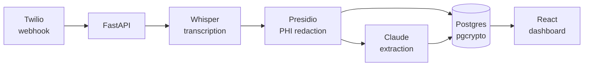

# Auris

> Outbound sales calls generate a paper trail that most teams can't safely keep.
> The recording lands in cloud storage, a human or model transcribes it, and suddenly
raw PHI — names, dates of birth, insurance IDs — is sitting in a database with no
audit trail and no redaction. 
Auris is a pipeline built to close that gap: every
recording is transcribed, scrubbed of PHI before a single byte touches the database,
structured by an LLM, and surfaced in an audit-aware dashboard.

## Pipeline

Raw transcript text exists only inside the redaction step — it is never logged,
stored, or forwarded. The redacted text written to the database is encrypted at rest
with pgcrypto.

## Architecture

**Monorepo — two runtimes, one database**
`client/` is a React Router v7 SPA running on Node. `server/` is a FastAPI service
running on Python 3.11. Both talk to the same local Postgres instance (Supabase-ready
— a `DATABASE_URL` swap is the only migration needed).

**Dual-runtime auth without a token exchange**
Better Auth runs inside the Node server and owns session creation. FastAPI validates
sessions by querying the `sessions` table directly via asyncpg — no separate auth
service, no JWT round-trip. The browser cookie is the only credential that moves.

**PHI boundary**
`server/app/services/redaction.py` is the only file where raw transcript text exists.
Every other layer — storage, extraction, the API, the dashboard — operates on redacted
text only. This is enforced by design, not by policy.

**Background pipeline, not a queue**
FastAPI's `BackgroundTask` handles the full webhook → transcription → redaction →
extraction chain. Sufficient for MVP volume; Celery is a drop-in replacement when
throughput demands it.

## Key decisions

| Decision | Rationale |
|----------|-----------|
| Whisper API, not local | Zero infra for MVP; swap to faster-whisper when latency matters |
| Raw asyncpg, no ORM | Python-native stack (Presidio, Anthropic SDK) needs no extra abstraction layer |
| Postgres for sessions | Single `DATABASE_URL`; FastAPI cross-queries without a Redis dependency |
| React Router v7 SPA | Lighter than Next.js; deploys to Vercel without server config |
| `BackgroundTask` not Celery | Sufficient for MVP volume; Celery added when throughput demands it |
| Local Postgres → Supabase | Schema is identical; no migration beyond swapping the connection string |

## Stack

| Layer | Technology |
|-------|------------|
| Webhook + call delivery | Twilio |
| API | FastAPI (Python 3.11) |
| Transcription | OpenAI Whisper API |
| PHI redaction | Microsoft Presidio |
| Structured extraction | Claude (Anthropic) |
| Database | Postgres + pgcrypto |
| Auth | Better Auth |
| Frontend | React + React Router v7 |
